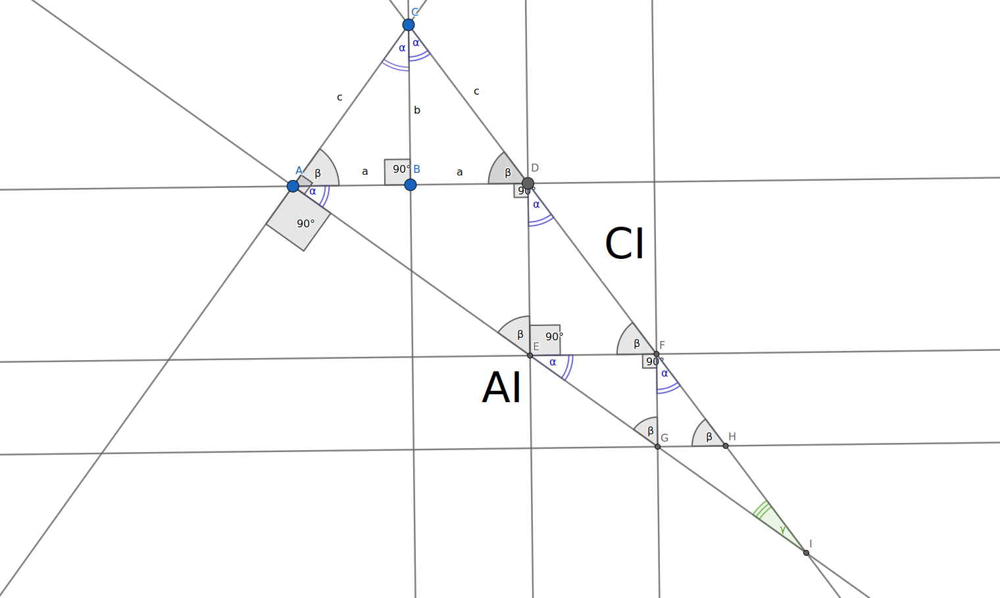

# PythagoreanProofImage

Fixing the image for :
https://keith-mcnulty.medium.com/heres-how-two-new-orleans-teenagers-found-a-new-proof-of-the-pythagorean-theorem-b4f6e7e9ea2d

The angle alpha + beta is a right angle, otherwise you can't understand why sin(2*alpha) = AI/CI

